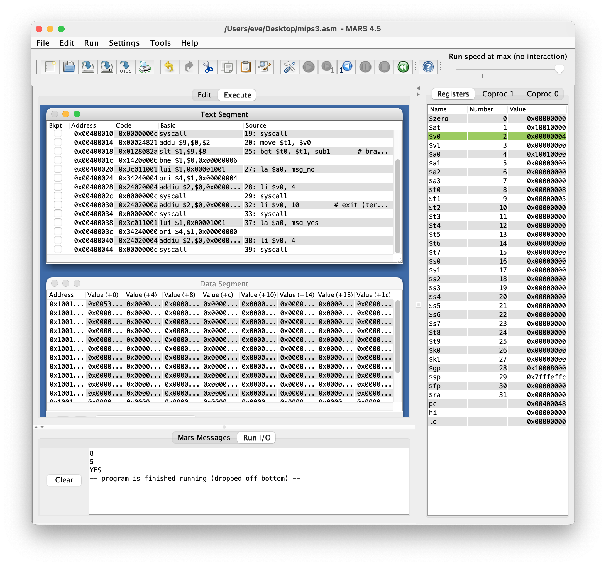

# Simple Introduction of the MIPS 

## Set up

Resources video: https://www.bilibili.com/video/BV1kW411e7ct/?spm_id_from=autoNext&vd_source=73e7d2c4251a7c9000b22d21b70f5635

Install the `MARS` from the https://courses.missouristate.edu/kenvollmar/mars/download.htm

Then you will have the `Mars4_5.jar`


## Hello World


When you run the instruction, you save the file first and then click the `Run-> Assemble -> Run one step a time`. You can see the every step in the execute window and the different value in the registers.


```assembly
li  $t1, 1       # let register $t1 = 1
add $t0, $t1, 2  # $t0 = $t1 + 2  

# printf("%d", t0)

# $v0 = 1, syscall -> print_int
# $v0 = 4, syscall -> print_string
# syscall only can print the value in $a0
move $a0, $t0      # move the value of register $t0 to register $a0
li $v0, 1          # let register $v0 = 1
syscall            # in the run I/O window you will see print the value of $a0 = 3
```


汇编语言会把整数分段，两个比较重要的段叫做代码段和数据段

先把要输出的东西放在数据段里`.data`, 等下要运行的东西放在代码段里`.text`.

运行的时候是先从`.text`的代码段中开始， 有点儿类似于在C语言中的main函数. `.data`下的都是全局变量. 

```assembly
.data 
# char* msg = "Hello World"; // in c
# msg like C, valuable name and tell it is word, string .asscii; msg kind like address
msg: .ascii "Hello World"     

.text
la $a0, msg           # load address la must the first is register second address or string
li $v0, 4             # $v0 = 4, syscall -> print_string
syscall 
```


`syscall` 要配合 register `$v0` 使用, if value of `$v0` is 1 then it will print int, if value is 4, then it will print string. In the help window, it will shows different value of `$v0` for the `syscall` will have different functions.


Some important value like `10` , means exit (terminate execution). This will often use in the loops for stopping. 


## IF

```
scanf("%d", &a);
scanf("%d", &b);
if (a > b){
	printf("YES");
}else{
	printf("NO");
}
```

Transfer the above code into assemble language. 


```assembly
# scanf("%d", &a);        $t0 = a
# scanf("%d", &b);        $t1 = b


# should we store the data in the CPU then we can calucale in asm language

# read help syscalls, number 5 is what we want 

li $v0, 5
syscall 
```


```assembly
.data
	msg_yes:	.ascii	"YES\0"    #\0 means stop it will not continue
	msg_no:		.ascii 	"NO\0"	   # if not \0 when 8 5, it will be YESNO
	
.text
# scanf("%d", &a);        $t0 = a
# scanf("%d", &b);        $t1 = b


# should we store the data in the CPU then we can calucale in asm language

# read help syscalls, number 5 is what we want 

li $v0, 5
syscall 
move $t0, $v0

li $v0, 5
syscall
move $t1, $v0

# if (a > b) {printf("YES")}; 
# if ($t0 > $t1)

bgt $t0, $t1, sub1       # branch greater than: if $t0>$t1 jump to sub1
# else printf("NO");
la $a0, msg_no
li $v0, 4
syscall 

# here need to stop the program, if not it will keep continue
li $v0, 10         # exit (terminate execution)
syscall

sub1:
# if printf("YES");
la $a0, msg_yes
li $v0, 4
syscall 
```




## Loop

Now, use assemble language to write an program `1+2+3+4+...+100`

```c
1+2+3+... +100
  
i = 1;
s = 0;

while (i <= 100){
  s = s + i;
  i = i + 1;
}
printf("%d", s);
```

```assembly
# i = 1;    $t0: i
# s = 0;    $t1: s

li $t0, 1
li $t1, 0

loop: 
	# s = s+i;
	# i = i + 1;
	add $t1, $t1, $t0
	add $t0, $t0, 1

ble $t0, 100, loop       # branch less

move $a0, $t1
li $v0, 1
syscall 
```


## Future

数组, 数字数组, 整数数组, 小数数组, 负数, 文字数组, 函数, 函数怎么传