# Project 4

## 4.1 Help for Computer-Aided Design (CAD) tools on Lyle Engineering Computers

The Lyle servers have various CAD tools that we use in course assignments and research projects. This page provides links to information on tools used by our students for electronic design automation.

https://s2.smu.edu/~manikas/CAD_tool_info.html

### 4.1.1 Lyle Unix Account

In order to run the tools on the Lyle servers, you will need to set up a Lyle Unix account. Note that it may take up to 48 hours for a new account to be activated, so plan accordingly. Information on how to set up a new account can be found at https://www.smu.edu/OIT/Services/genuse.

The servers are called "genuse" (General Use) machines. The list of machines can be found at https://www.smu.edu/OIT/Services/genuse#general-use-linux-machines

If this is your first time with Unix (or need a review), [please visit this page.](https://s2.smu.edu/~manikas/CAD_Tools/Unix/UnixHelp.html)

Welcome to the SMU general use (genuse) linux environment!

Your login is valid on all general use (genuse) servers.
A list of general use servers and other information can be found here: 
  https://www.smu.edu/OIT/Services/genuse

Add the domain "smu.edu" to any of the general use server hostnames for remote access.
  For example: ssh [bingyingl@genuse54.smu.edu](mailto:bingyingl@genuse54.smu.edu)

Your genuse username is: bingyingl
Password is your SMU password.

If you have any questions, send email to: [help@smu.edu](mailto:help@smu.edu)

SMU ID: 48999397, password：Abcdef#123456

#### How to SSH on Mac

`ssh user@IP-Address`

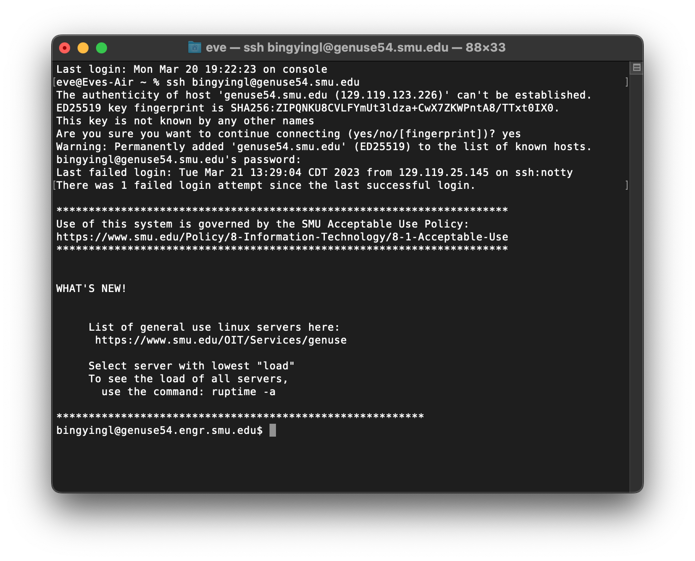

### 4.1.2 X-Windows Emulators

After you have set up your account, you will also need to set up X-Windows emulation to run the CAD tools. The type of emulator to use will depend on your PC platform (Windows or Mac).

1. For Windows machines, use Xming. [Click here for information on installing and using Xming (PDF).](https://s2.smu.edu/~manikas/CAD_Tools/UsingXming.pdf)
2. For Macs, use the program "X11" (Applications/Utilities/X11.app). If this program is not currently installed on your Mac, it is available on the OS X installation DVD that came with your computer -- install this program. To enable forwarding, run the X11.app before starting the Terminal.app. You may close the xterm window that pops up and use Terminal.app, or you may use this X11 terminal instead. Once X11 is running, when you log into remote UNIX servers (using the -Y option to ssh above), you should be able to display remote graphics. For more information, follow the link http://faculty.smu.edu/reynolds/unixtut/osx.html.

#### X11 for Windows and Mac

X11 is a remote-display protocol used by Linux/Unix machines, including the Linux machines at Thayer. By running an X11 program (known as a **server**) on your computer, you can access graphical Linux programs remotely through an SSH client. In addition some Unix applications ported to macOS do not run natively under the macOS GUI and require X11.

Terminology Note: The program displaying graphics on your local machine is called an *X Server*, and the process on the remote end is called an *X client*. Yes, this may be backwards from what you might first expect. You can think of this program providing local graphics services for client programs running remotely.

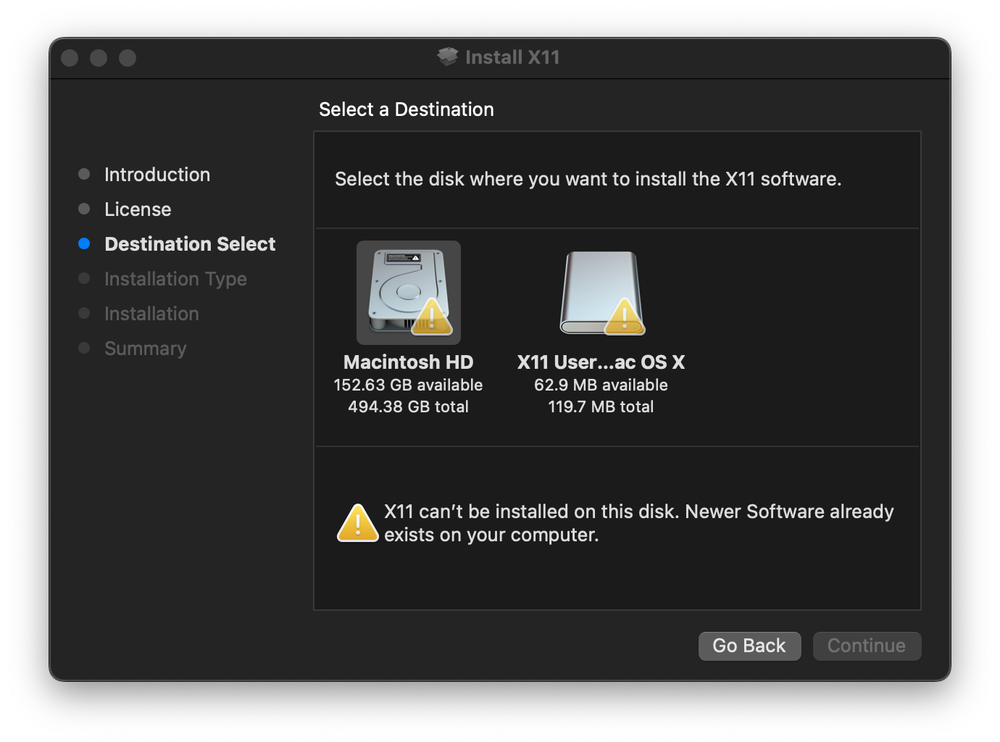

We can use XQuartz https://www.xquartz.org

For OS, we have to modify 

`eve@Eves-Air ~ % sudo vim /etc/ssh/sshd_config`

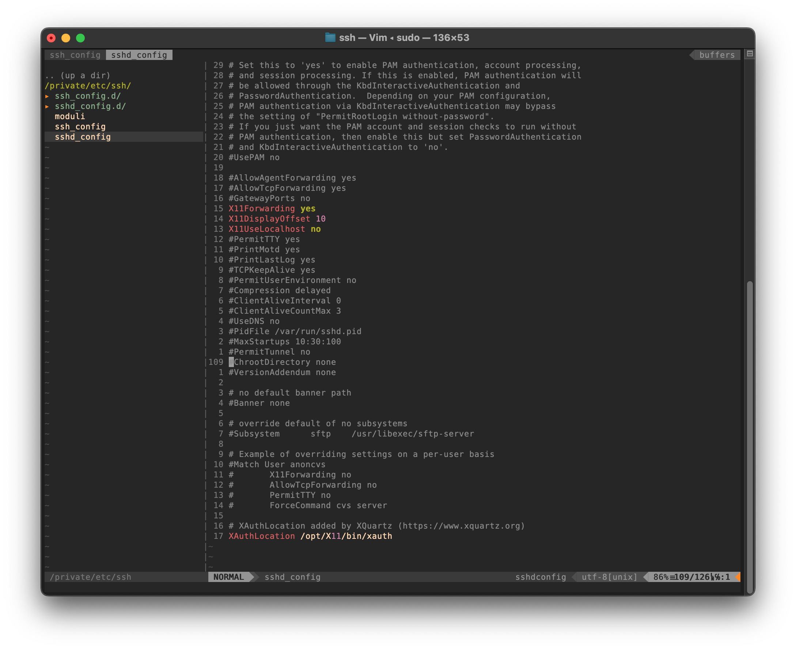

Then restart, and ssh to use `xclock` to check.

### 4.1.3 Verilog - Cadence Xcelium

Verilog is a hardware description language (HDL) for developing and modeling circuits. The Cadence Xcelium tool will help you simulate circuits that have been developed in Verilog. [Click here for more information](https://s2.smu.edu/~manikas/CAD_Tools/Verilog/Xcelium.html).

#### 4.1.3.1 Basic Xcelium Tutorial

For this tutorial, the results will be displayed on a console. Therefore, the Xcelium tool may be used in your X-windows emulator or console window (e.g., Putty). 

Use the following files for this tutorial:

- [**half_adder.v**](https://s2.smu.edu/~manikas/CAD_Tools/Verilog/half_adder.v) Verilog file that implements a half-adder circuit 
- [**half_adder_tb.v**](https://s2.smu.edu/~manikas/CAD_Tools/Verilog/half_adder_tb.v) Testbench file to test the half-adder circuit

To run the Verilog program using these files, use the command: **xmverilog half_adder.v half_adder_tb.v**

The program will print the results on the console. The results will also be written to the **xmverilog.log** file. 

To exit the program, use the command: **exit**

`mkdir project4` and then create two files `half_adder.v` , `half_adder_tb.v`

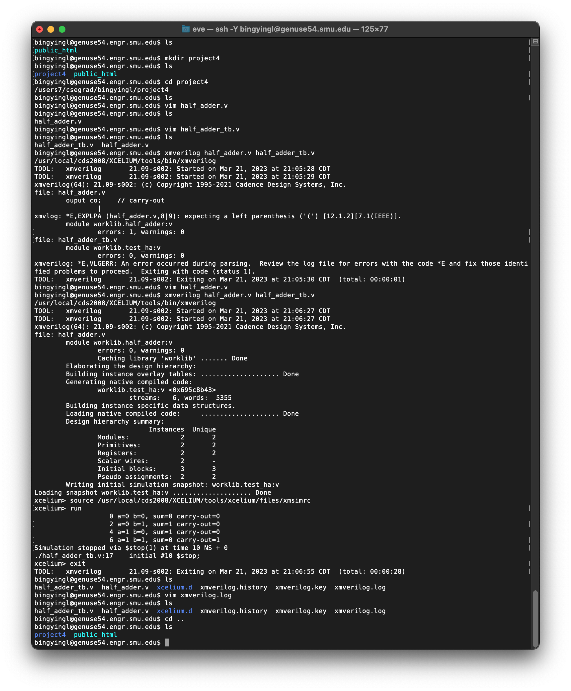

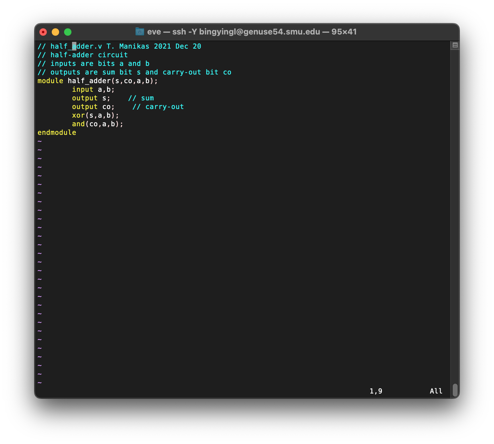

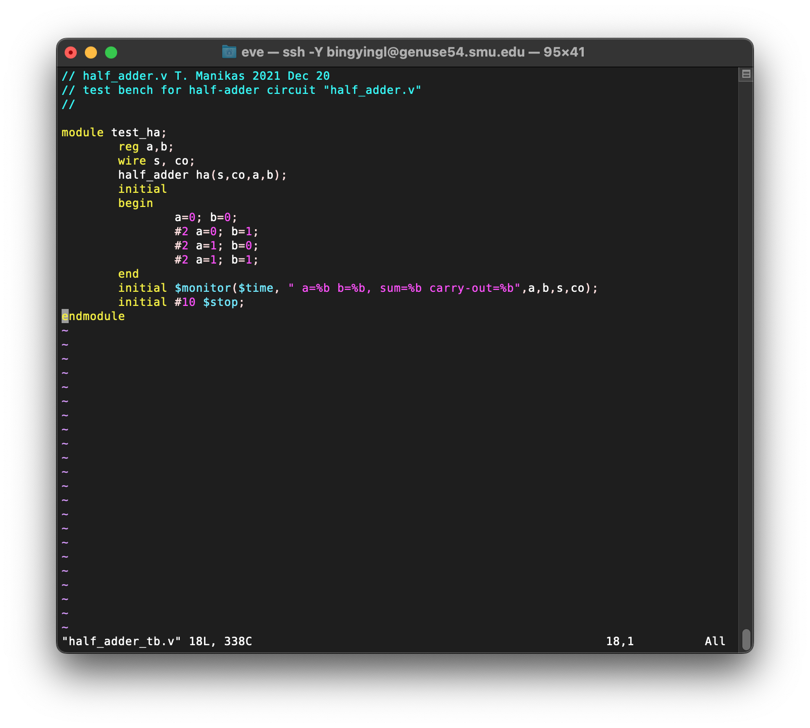

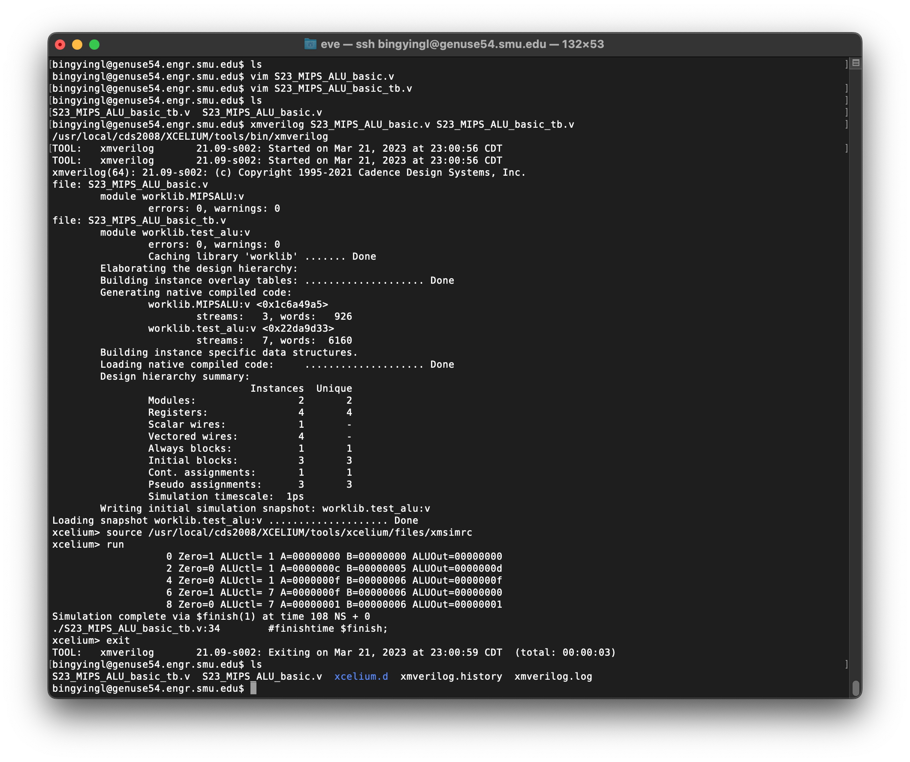

#### 

#### How To Download Files from Server

`scp username@servername:/path/filename /Users/eve/Desktop`

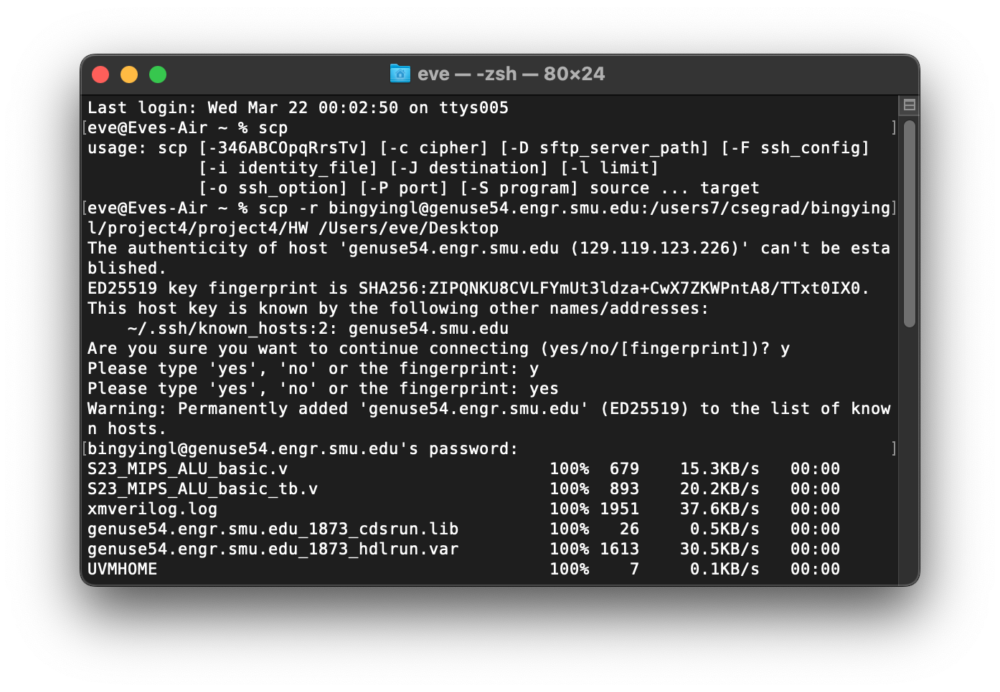

`scp ` this command should in the terminal not in the ssh window.!!! (It costs me a lot of time to figure out this bug).

`-r` : download the whole directory.

#### How To Upload File From Local

`scp /path/filename username@servername:/path` 

1. Upload File to the server

   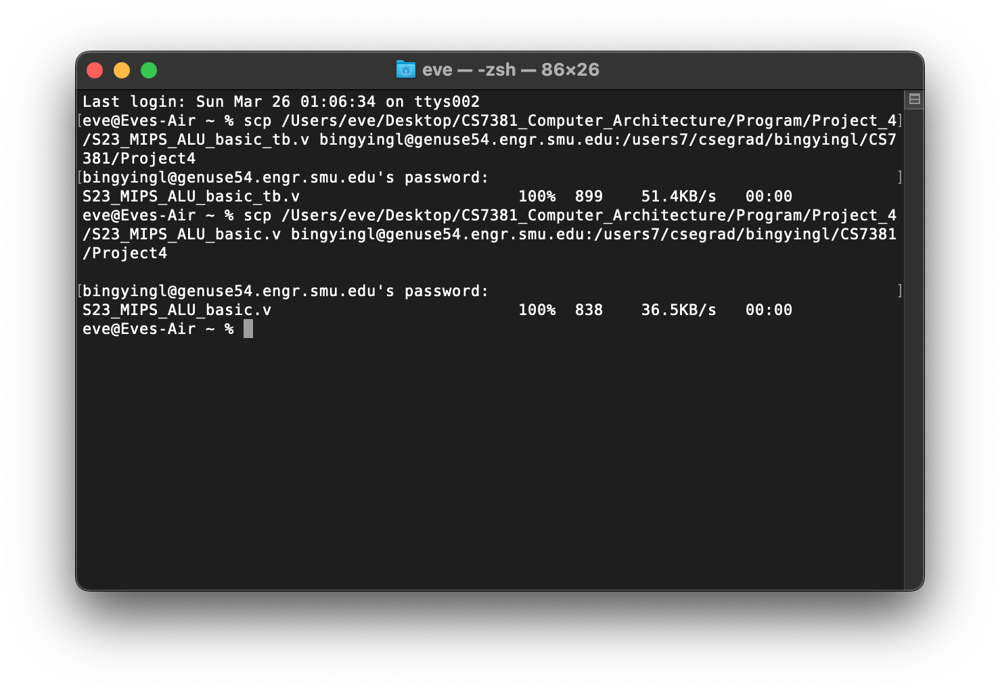

   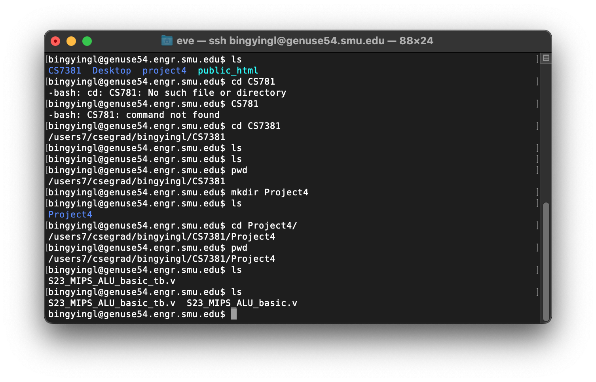

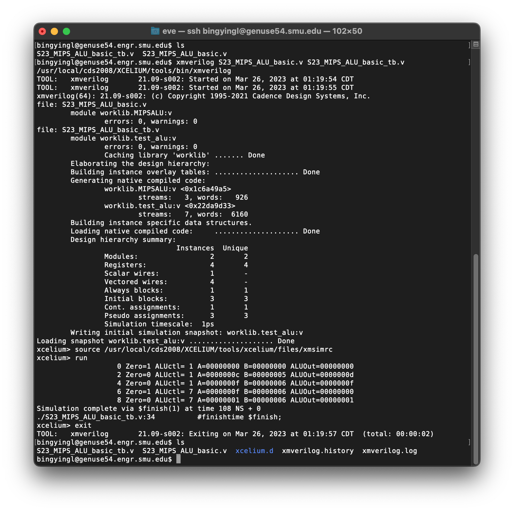

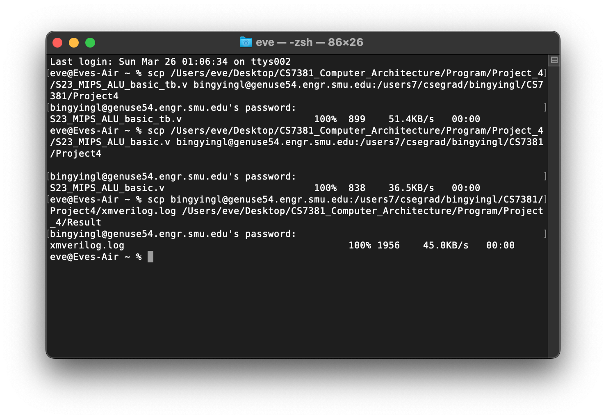
