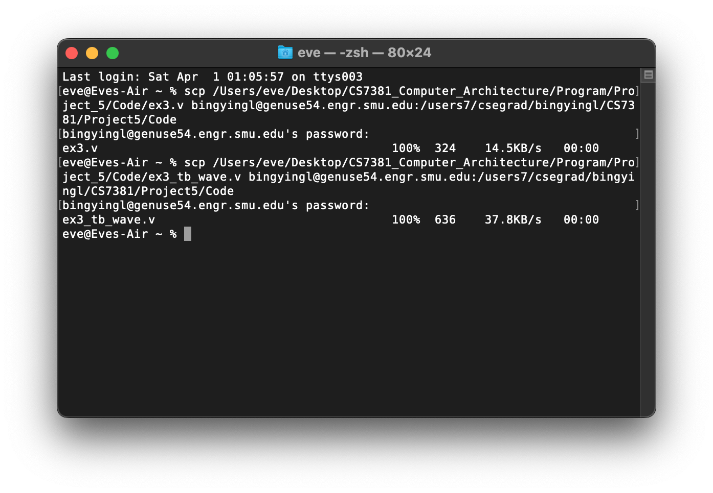
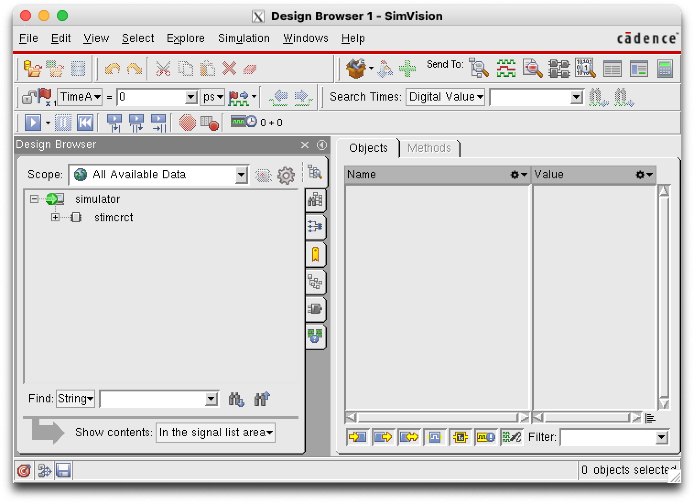
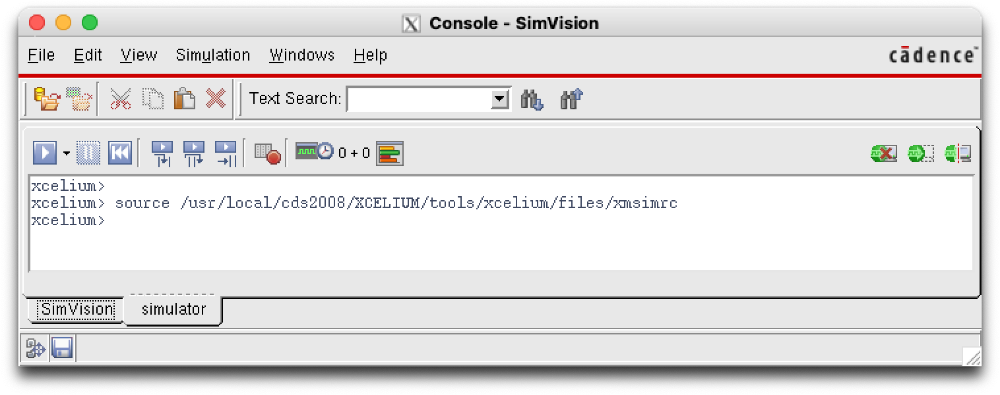
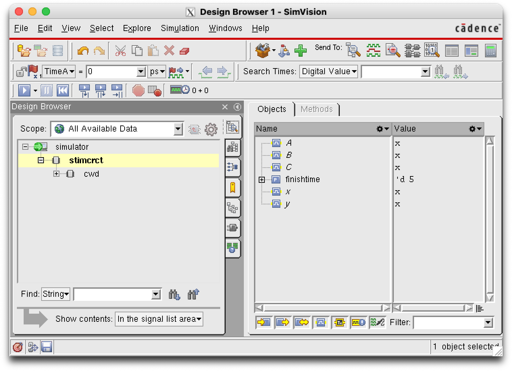
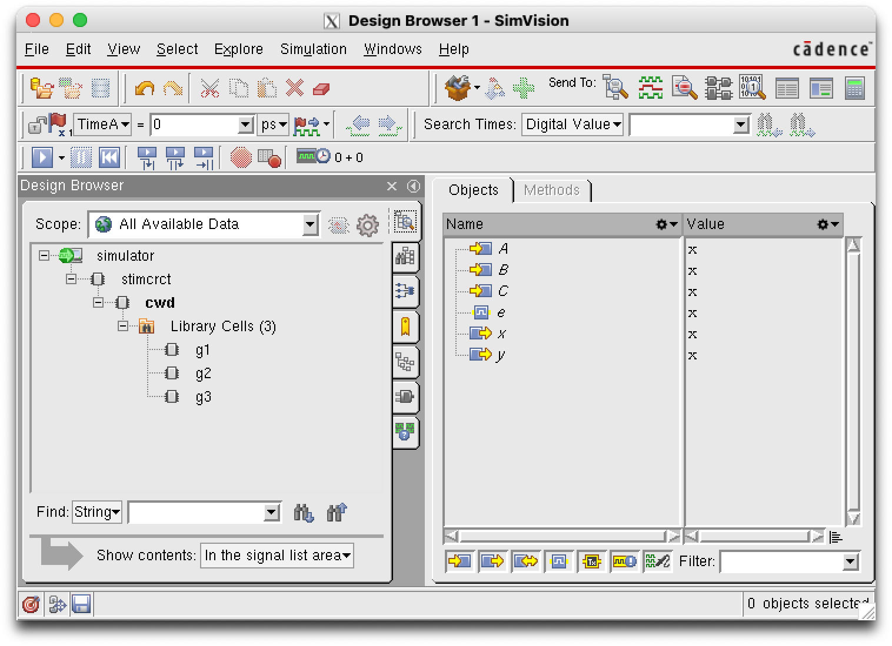
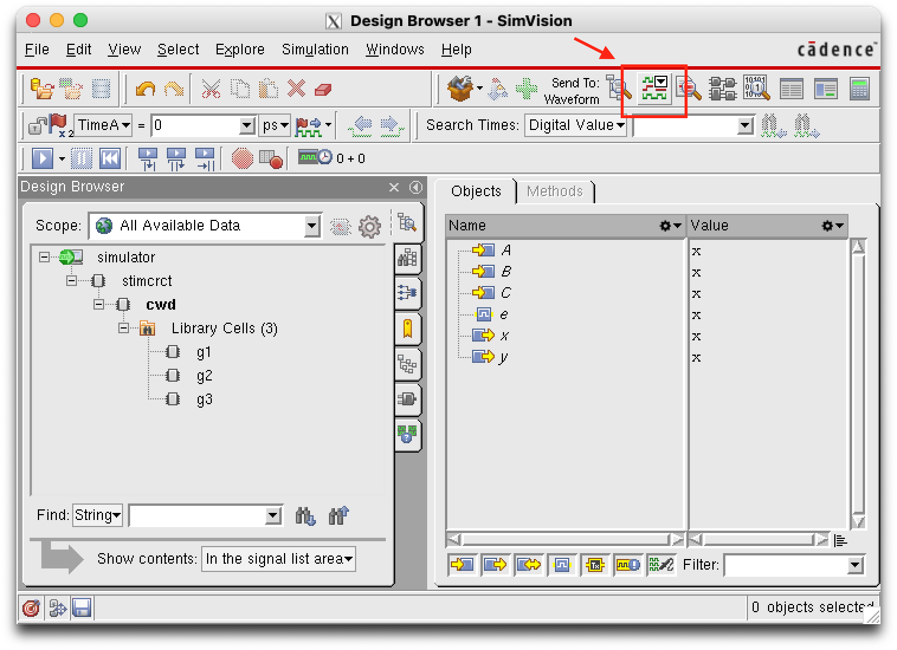
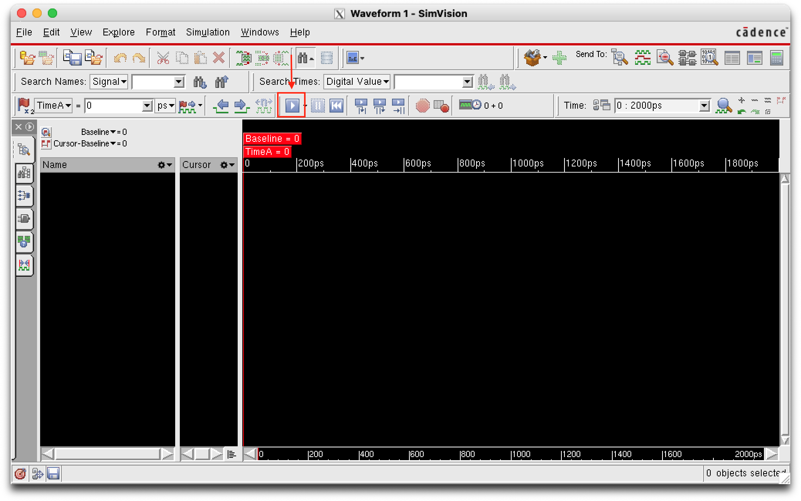
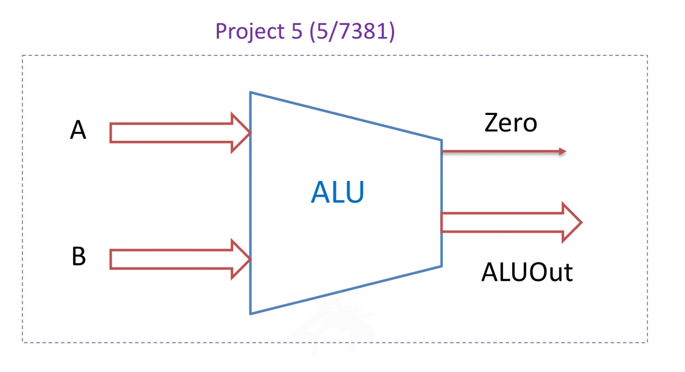

# Project 5


## **Tutorial for Cadence SimVision Verilog Simulator Tool**

### 2.1 Overview

The SimVision simulator tool can show waveforms for Verilog code. These waveforms help identify circuit delays and other timing issues in Verilog circuits.

### 2.2 **Preliminary Setup**

The example code simulates the behavior of a simple logic circuit, shown below. Note that each logic gate has a delay value indicated in nanoseconds (ns).


You will use the following Verilog files for your simulation example:

1. `ex3.v`: Verilog code for simple logic circuit
2. `ex3_tb_wave.v`: testbench code to test logic circuit and generate waveforms

a. NOTE: the testbench has a 50 ns clock period (clock rate = 20 MHz). The inputs to the testbench module will update every clock period (DELAY value)

#### 2.2.1 Program Code for `ex3.v`

```verilog
// ex3.v
// T. Manikas 2022 Jan 12
// simple structural circuit with delay // add timescale of 1 ns
// modify gate delays
`timescale 1ns/10ps
// Description of circuit with delay module circuit_with_delay (A,B,C,x,y);
      input A,B,C;
      output x,y;
      wire e;
      and #(15) g1(e,A,B);
      not #(5) g2(y,C);
      or #(10) g3(x,e,y);
endmodule
```


#### 2.2.2 Program Code for `ex3_tb_wave.v`

```verilog
// ex3_tb_wave.v
// T. Manikas  2022 Jan 13
// testbench for ex1.v module
// add timescale of 1 ns
// display waveform for output
`timescale 1ns/10ps
`define DELAY 50
// Stimulus for simple circuit
module stimcrct;
   parameter finishtime = 5;
reg A, B, C;
wire x, y;
circuit_with_delay cwd (A, B, C, x, y);
   initial begin
      #0 A=1'b0; B=1'b0; C=1'b0;
      #`DELAY
      C=1'b1;
      #`DELAY
      B=1'b1;
      #`DELAY
      A=1'b1;
      $stop;
end
initial begin
$monitor($time," A=%b B=%b C=%b x=%b y=%b",A,B,C,x,y);
end
endmodule
```


### 2.3 Starting SimVision Tool and Reading in the Verilog files



Upload example file first. (P.S.: bingyingl@genuse54.engr.smu.edu`:` + no space)

1. At the Unix prompt, type the following command:

   `xmverilog -gui -access +rw ex3.v ex3_tb_wave.v &`

2. If there are no errors, two windows will pop up: **Console** and **Design Browser 1**.






### 2.4 View Waveforms

#### 2.4.1 Setup

1. In the Design Browser Window, click on "+" next to **stimcrct**. This will cause **cwd** to be displayed under **stimcrct.**

   

   

   


2. Click on "+" next to **cwd**. This will display **g1, g2,** and **g3**.

3. Click on **cwd**. This will display all signals (A,B,C,e,x,y) to be displayed in the **Objects** area.

   

#### 2.4.2 Waveform Viewer

1. Click on the **Waveform** icon:



2. This will open the **Waveform** window. Click on the **Run** icon to generate the signal waveforms for our example Verilog circuit:






```verilog
// ============================================================
// S23_MIPS_ALU_basic.v
// T. Manikas	2022 Dec 27
//
//
// basic ALU (Arithmetic-Logic Unit) for MIPS processor
// ============================================================

`timescale 1ns / 1ps

module MIPSALU (ALUctl, A, B, ALUOut, Zero);
	input [3:0] ALUctl;		// ALU control signals
	input [31:0] A, B;		// ALU input values (operands)
	output [31:0] ALUOut;		// result of ALU operation
  reg [31:0] ALUOut;	//31 和0 定义了范围, 表示了位宽. 此处是32位位宽, 就是说表示成32'b0至32'b11111111111111111111111111111111(32'hFFFFFFFF) 降序排序 此处是32位的寄存器型信号
	output Zero;			// ZERO flag

		// ZERO flag set if ALU result is 0

  assign Zero = (ALUOut==0); // assign语句是连续赋值语句, 一般是将一个变量的值不间断地赋值给另一变量, 两个变量之间就类似于被导线连在一起, 习惯上当做连线用. assign语句的基本格式是 assing a = b (逻辑运算符) c;
  

		// do if any change in ALUctl, A, B

	always @(ALUctl or A or B)
	begin
	  case (ALUctl)
		1:  ALUOut <= A | B;		// bitwise OR
		7:  ALUOut <= A < B ? 1 : 0;	// set if A < B
		default:  ALUOut <= 0;
	  endcase
	end
endmodule
```

``` verilog
// ============================================================
// S23_MIPS_ALU_basic.v
// T. Manikas	2022 Dec 27
//
//
// basic ALU (Arithmetic-Logic Unit) for MIPS processor
// ============================================================

`timescale 1ns / 1ps

module MIPSALU (ALUctl, A, B, ALUOut, Zero);
	input [3:0] ALUctl;		// ALU control signals
	input [31:0] A, B;		// ALU input values (operands)
	output [31:0] ALUOut;		// result of ALU operation
	reg [31:0] ALUOut;	
	output Zero;			// ZERO flag

		// ZERO flag set if ALU result is 0

	assign Zero = (ALUOut==0);

		// do if any change in ALUctl, A, B

	always @(ALUctl or A or B)
	begin
	  case (ALUctl)
		1:  ALUOut <= A | B;		// bitwise OR
		7:  ALUOut <= A < B ? 1 : 0;	// set if A < B
		0:  ALUOut <= A & B;              // A and B  
		2:  ALUOut <= A + B;              // ADD (A+B)
		6:  ALUOut <= A - B;               // SUB (A-B)
		12: ALUOut <= ~(A | B);              // NOR (A nor B)
		14: ALUOut <= A ^ B;              // XOR (A \oplus) B
		default:  ALUOut <= 0;
	   endcase
	end
```


```verilog
// ============================================================
// S23_MIPS_ALU_soln_tb.v
// T. Manikas	2022 Dec 27
//
// testbench for S23_MIPS_ALU_soln
// ============================================================

`timescale 1ns / 1ps

module test_alu;

     parameter finishtime = 100;

	reg [3:0] ALUctl;
	reg [31:0] A, B;
	wire [31:0] ALUOut;
	wire Zero;
	MIPSALU u1(ALUctl, A, B, ALUOut, Zero);

	initial     // 只循环一次
	begin
	   ALUctl = 4'h0;	// start with AND function
					// A = 0, B = 0
	   A = 32'h0;
	   B = 32'h0;          // 
	end

	initial
	begin
	   #2 A = 32'hC; B = 32'h4;	// C and 4 = 4    A=12 B=4 // 
	   #2 A = 32'hF; B = 32'h6;	// F and 6 = 6    A=15 B=6    // Zero = 1 A

                  // OR function
	   #2 ALUctl = 4'h1;		      // F or 6 = F     // 1 
	   #2 A = 32'hC; B = 32'h4;	// C or 4 = C

                  // ADD function
	   #2 ALUctl = 4'h2;            // C + 4 = 0010
	   #2 A = 32'h1;                // 1 + 4 = 5

                  // SUB function
	   #2 ALUctl = 4'h6;		// 1 - 4 = FFFF FFFD
	   #2 A = 32'hF;		// F - 4 = B

                  // set if A<B function
	   #2 ALUctl = 4'h7;		// F < 4? should be false
	   #2 A = 32'h2;		// 2 < 4? should be true

                  // NOR function
	   #2 ALUctl = 4'hC;		// NOR(2,4) = FFFF FFF9	
	   #2 A = 32'hFFFF;		// NOR(FFFF,4) = FFFF 0000

                  // XOR function
	   #2 ALUctl = 4'hE;       // XOR(FFFF,4) = 0000 FFFB
	   #2 B = 32'h0000;        // XOR(FFFF,0000) = 0000 FFFF
 
         #finishtime $finish;

	end

	initial $monitor($time, " Zero=%b ALUctl=%d A=%h B=%h ALUOut=%h",
			Zero, ALUctl, A, B, ALUOut);

endmodule

```

Result: 

```verilog
                   0 Zero=1 ALUctl= 0 A=00000000 B=00000000 ALUOut=00000000
                   2 Zero=0 ALUctl= 0 A=0000000c B=00000004 ALUOut=00000004
                   4 Zero=0 ALUctl= 0 A=0000000f B=00000006 ALUOut=00000006
                   6 Zero=0 ALUctl= 1 A=0000000f B=00000006 ALUOut=0000000f
                   8 Zero=0 ALUctl= 1 A=0000000c B=00000004 ALUOut=0000000c
                  10 Zero=0 ALUctl= 2 A=0000000c B=00000004 ALUOut=00000010
                  12 Zero=0 ALUctl= 2 A=00000001 B=00000004 ALUOut=00000005
                  14 Zero=0 ALUctl= 6 A=00000001 B=00000004 ALUOut=fffffffd
                  16 Zero=0 ALUctl= 6 A=0000000f B=00000004 ALUOut=0000000b
                  18 Zero=1 ALUctl= 7 A=0000000f B=00000004 ALUOut=00000000
                  20 Zero=0 ALUctl= 7 A=00000002 B=00000004 ALUOut=00000001
                  22 Zero=0 ALUctl=12 A=00000002 B=00000004 ALUOut=fffffff9
                  24 Zero=0 ALUctl=12 A=0000ffff B=00000004 ALUOut=ffff0000
                  26 Zero=0 ALUctl=14 A=0000ffff B=00000004 ALUOut=0000fffb
                  28 Zero=0 ALUctl=14 A=0000ffff B=00000000 ALUOut=0000ffff
```


##### wire 和 reg的区别

reg型信号并不一定生成寄存器, 针对什么时候使用wire类型, 什么使用reg类型这一个问题, 总结出一套解决方法: 在本模块中使用always设计的信号都定义为reg型, 其他信号定义为wire型.

```verilog
reg [31:0] ALUOut;	// ALUOut 在always中使用
	output Zero;			// ZERO flag

		// ZERO flag set if ALU result is 0

	assign Zero = (ALUOut==0);

		// do if any change in ALUctl, A, B

	always @(ALUctl or A or B)
	begin
	   case (ALUctl)
		1:  ALUOut <= A | B;		// bitwise OR
		7:  ALUOut <= A < B ? 1 : 0;	// set if A < B
		default:  ALUOut <= 0;
	   endcase
	end
```


##### assign 语句


##### always语句

always语句是条件循环语句, 执行机制是通过对一个称为敏感变量表的事件驱动来实现的

alway语句的基本格式

```verilog
alway @(敏感事件)begin
  程序语句
end
```

当敏感事件的条件满足时, 就执行一次“程序语句”. 

```verilog
always @(a or b or d)begin
  if (sel == 0)
    c = a + b;
  else
    c = a + d;
end
```

这段程序的意思是: 当信号a或者信号b或者信号d发生变化时, 就执行一次下面语句. 在执行该段语句时, 首先判断信号sel是否为0, 如果为0, 则执行第三行代码. 如果sel不为0,则执行第5行代码. 需要强调的是a, b, c任何一个发生变化一次, 2 行至5行也就执行一次, 不会执行第二次.


```verilog
always @(*)begin
  if (sel == 0)
    c = a + b;
  else
    c = a + d;
end
```

当敏感信号非常多时很容易就会把敏感信号遗漏, 为避免这种情况可以用`*`来代替. 这个`*` 是指“程序语句”中所有的条件信号, 即把a, b, d, sel(不包括c), 也推荐这种写法. 这种条件信号变化结果立即变化的always语句被称为“组合逻辑”.


```verilog
always @(posedge clk)begin
    if (sel == 0)
    c <= a + b;
  else
    c <= a + d;
end
```

上述代码敏感列表是`posedge clk` , 其中posedge表示上升沿, 也就是说, 当clk由0变成1的瞬间执行一次程序代码, 即第2至5行, 其他时刻c的值保持不变. 要特别强调的是:如果clk没有由0变成1, 那么即使a,b,d,sel,发生变化, c的值也是不变的


```verilog
always @(negedge clk)begin
  if (sel == 0)
    c <= a + b;
  else
    c <= a + d;
end
```

可以看到上述代码的敏感列表是`negedge clk` , 其中negedg表示下降沿. 也就是说, 当clk由1变成0的瞬间执行一次程序代码, 即第2至5行, 其他时刻c的值保持不变. 要特别强调的是:如果clk没有由1变成0, 那么即使a,b,d,sel,发生变化, c的值也是不变的


```verilog
always @(posedge clk or negedge rst_n)begin
  if(rst_n == 1'b0)begin
    c <= 0;
  end
  else if (sel==1)
    c <= a + b;
  else
    c <= a + d;
end
```

当clk由0变成1的瞬间, 或者rst_n 由1变化0的瞬间.执行一次程序代码, 即2至8行, 其他时刻c的值保持不变.

这种信号边沿触发, 即信号上升沿或者下降沿才变化的always, 被称为“时序逻辑”, 此时信号clk是时钟. 注意: 识别信号是不是时钟不是看名称, 而是看这个信号放在哪里, 只有放在敏感列表并且是边沿触发的才是时钟. 而信号rst_n是复位信号, 同样也不是看名字来判断, 而是放在敏感列表中且同样边沿触发, 更关键的是“程序语句” 首先判断了rst_n的值, 这表示rst_n优先级最高, 一般都是用于复位.

设计时需要注意以下几点:

1. 组合逻辑的always语句中敏感变量必须写全, 或者用“*”代替
2. 组合逻辑器件的赋值采用阻塞赋值 “=“, 时序逻辑器件的赋值语句采用非阻塞赋值” <=“.


#### 数字进制

##### 数字表示方式

在Verilog中的数字表示方式, 最常用的格式是: `<位宽>'<基数><数值>`, eg. `4'b1011`

位宽: 描述常量所含位数的十进制整数, 是可选项.

基数: 表示数值是多少进制. 可以是b, B, d, D, o, O, h或者H, 分别表示二进制, 十进制, 八进制, 十六进制. 如果没有此项, 默认为十进制.

数值: 就是相应的进制的数


